# Integracion Empresarial OnLine
Author: Freddy Abad

UPS - Departamento de Posgrados

### PARA CORRER EL PROYECTO

Ejecutar los siguientes comandos para levantar un contenedor de postgres en Docker :
```bash
docker-compose build

docker-compose up 
```
**La documentacion tipo Postman se adjunta en el presente directorio (Integracion Empresarial En Linea.postman_collection.json). O en caso de hacerlo manualmente, en la seccion 'REQUERIMIENTOS ABORDADOS EN EL PROYECTO'  se detalla cada servicio.**

**El proyecto se encuentra configurado para que escuche en los puertos 80,5000,8080,por lo que es necesario que estos puertos esten libres para que se ejecute con normalidad**

**En caso de hacer cambios en el proyecto camel, se necesita que se compile y empaquete nuevamente para que se actualice los jar (mvn clean compile package).**

El proyecto camel se encuentra testeado en la siguiente version de java. En caso de buscar correr en local, colocar una version similar a: 

openjdk 17.0.10 2024-01-16 LTS

OpenJDK Runtime Environment Corretto-17.0.10.7.1 (build 17.0.10+7-LTS)

OpenJDK 64-Bit Server VM Corretto-17.0.10.7.1 (build 17.0.10+7-LTS, mixed mode, sharing)

#### Importante 
El docker compose define 3 servicios:
- servicio1: Servicio desarrollado en Flask que simula la empresa que gestiona clientes online.
- servicio2: Servicio desarrollado en Flask que simula la empresa que gestiona clientes offline.
- servicio3: Integracion en apache camel, que filtra por canal y redirige al servicio1 o 2 segun cumpla el criterio.


### INFORMACION DEL PROYECTO

El proyecto se genero usando:
- Apache Camel como herramienta orientada a integracion empresarial.
- Flask como herramienta orientada a generar servicios web. Los servicios almacenan en memoria la informacion de los clientes.

### ESTRUCTURA DEL PROYECTO
Como se ve en la siguiente imagen se tiene una jerarquia dentro del proyecto (camel-integrationinline-fabad/src/main/java/org/apache/camel/learn):

- builder: Clase que extiende de RouteBuilder, donde se detalla el flujo a seguir en la validacion, insercion, logs.
- model: Clase que modela cada linea para el manejo interno del servicio.
- processor: Clases que contienen la logica de cada uno de los pasos establecidos en el paquete builder


### REQUERIMIENTOS ABORDADOS EN EL PROYECTO

A continuacion, se detalla cada uno de los servicios:

##### SERVICIOS CAMEL

REQUEST ENVIADO POR CAMEL CON CLIENTE ONLINE
```bash
URL - POST METHOD
http://localhost:80/receive_client_info
BODY (raw tipo json):
{
        "codigo": 1,
        "identificacion": "user1Online",
        "nombre": "Juan Perez Online",
        "email": "user2@example.com",
        "canal": "online"
}
```
REQUEST ENVIADO POR CAMEL CON CLIENTE OFFLINE
```bash
URL - POST METHOD
http://localhost:80/receive_client_info
BODY (raw tipo json):
{
        "codigo": 1,
        "identificacion": "user1Offline",
        "nombre": "Juan Perez Offline",
        "email": "user2@example.com",
        "canal": "offline"
}
```
REQUEST ENVIADO POR CAMEL CON CLIENTE CON CANAL DIFERENTE A LOS DEFINIDOS
```bash
URL - POST METHOD
http://localhost:80/receive_client_info
BODY (raw tipo json):
{
        "codigo": 2,
        "identificacion": "user2Online",
        "nombre": "Juan Perez Online",
        "email": "user2@example.com",
        "canal": "personal"
}
```
REQUEST ENVIADO POR CAMEL PARA RECUPERAR CLIENTES OFFLINE U ONLINE
```bash
http://localhost:80/users/offline
http://localhost:80/users/online
```
##### SERVICIOS FLASK

REQUEST ENVIADO POR FLASK CON CLIENTE ONLINE
```bash
URL - POST METHOD
http://localhost:8080/users
BODY (raw tipo json):
{
    "codigo": 623457,
    "identificacion": "user2",
    "nombre": "Juan Perez",
    "email": "user2@example.com",
    "canal": "online"
}
```
REQUEST ENVIADO POR FLASK CON CLIENTE OFFLINE
```bash
http://localhost:5000/users
URL - POST METHOD
BODY (raw tipo json):
{
    "codigo": 623457,
    "identificacion": "user2",
    "nombre": "Juan Perez",
    "email": "user2@example.com",
    "canal": "offline"
}
```

REQUEST ENVIADO POR FLASK PARA RECUPERAR CLIENTES OFFLINE U ONLINE
```bash
http://localhost:8080/get_users
http://localhost:5000/get_users
```

### EVIDENCIAS DE EJECUCION

Creacion Usuario Offline en Apache Camel

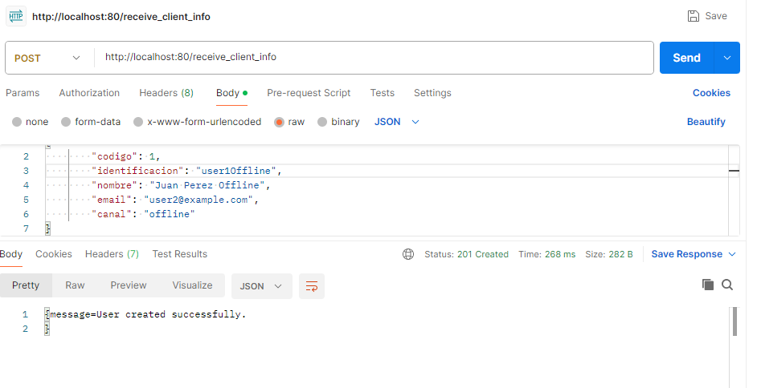

Log de Creacion Usuario Offline en Apache Camel

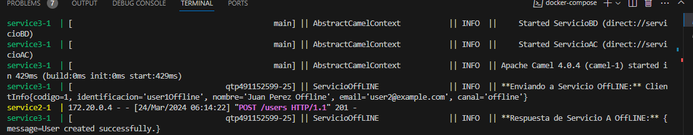

Creacion Usuario Online en Apache Camel

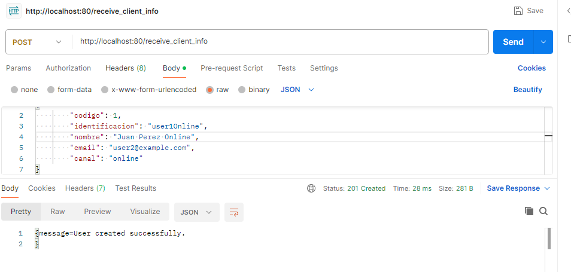

Log Creacion Usuario Online en Apache Camel

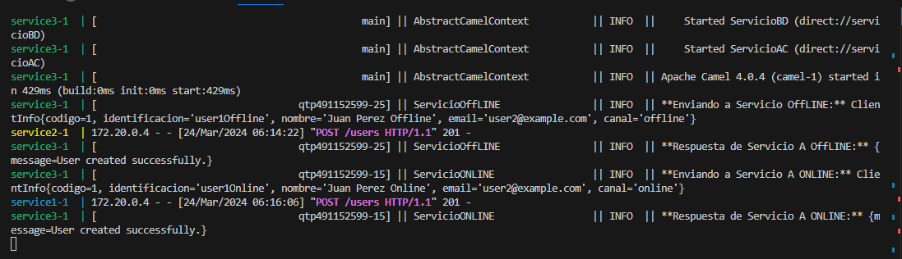

Creacion Usuario Otro Canal en Apache camel

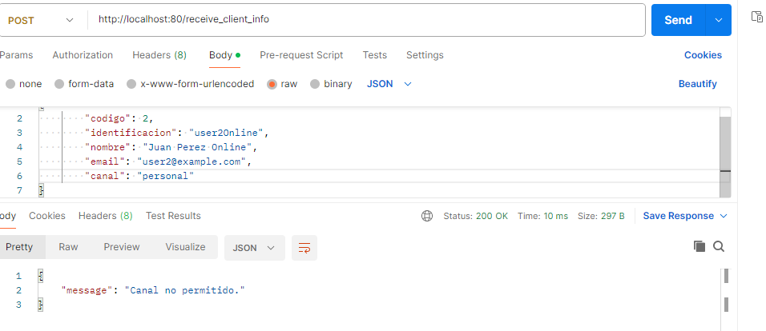

Listar Usuario Offline en Apache camel

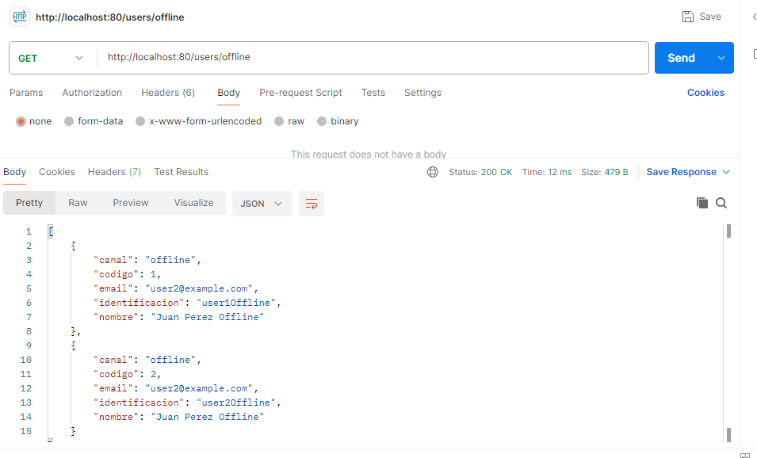

Listar Usuario Online en Apache camel

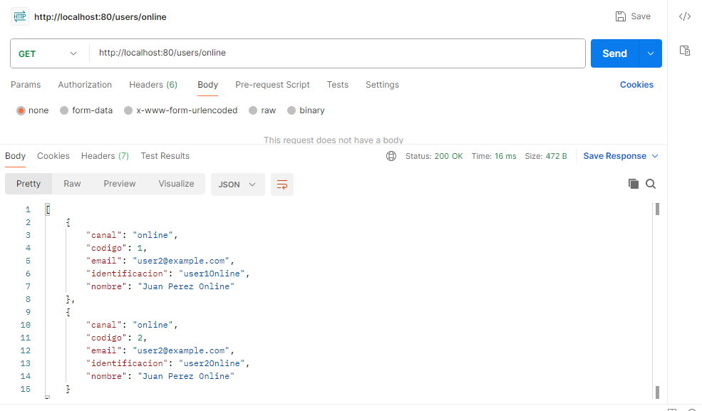

Creacion Usuario Offline Servicio flask

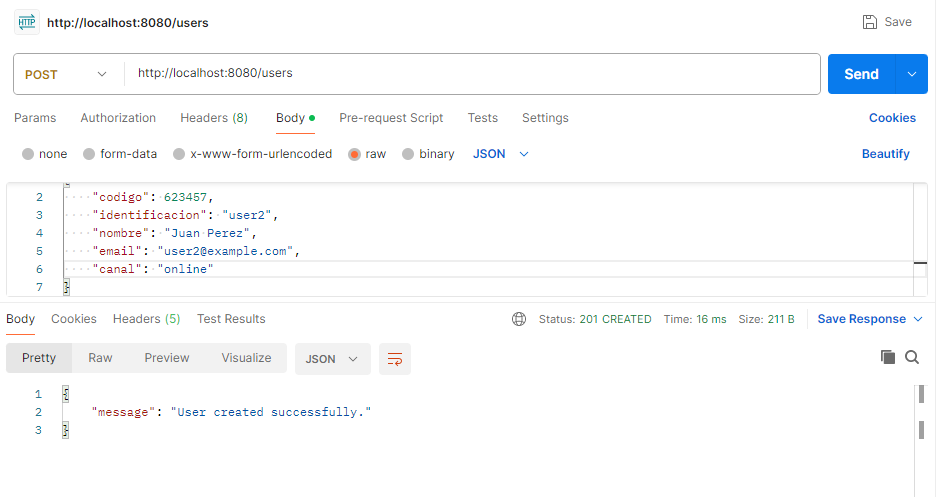

Creacion Usuario Online Servicio flask

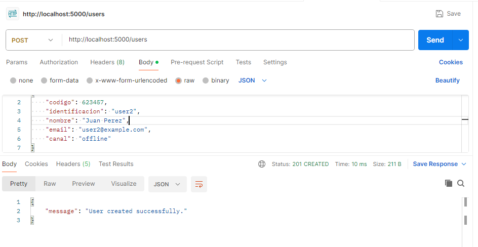

Listar Usuario Offline Servicio flask

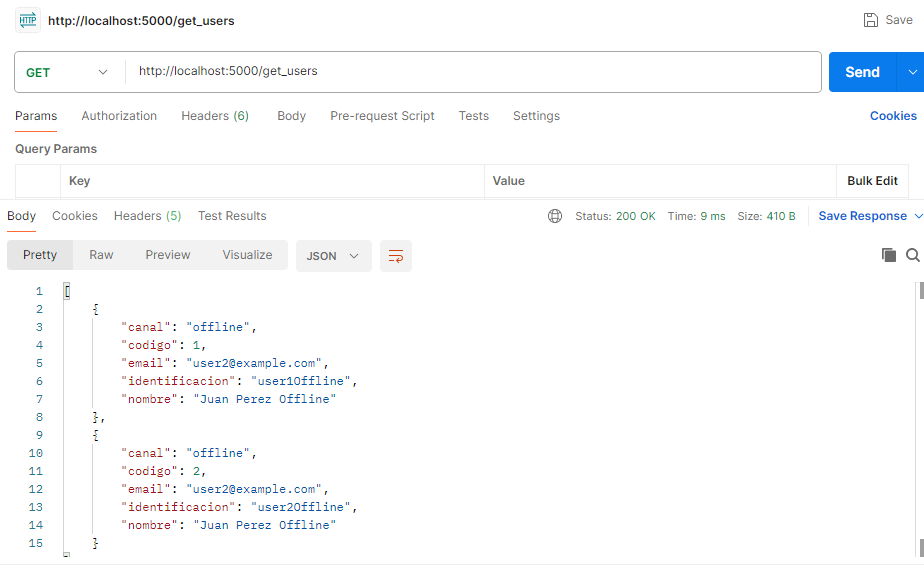

Listar Usuario Online Servicio Flask

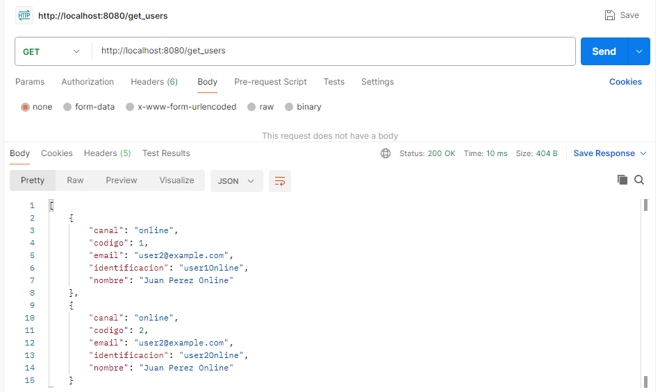
